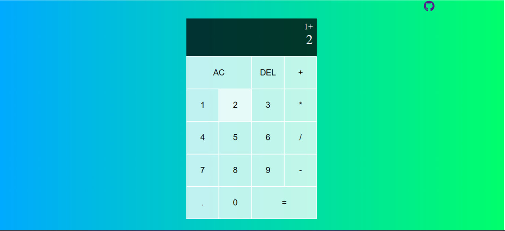

# ReactJS Calculator
This is a simple calculator app built with ReactJS. It supports basic arithmetic operations such as addition, subtraction, multiplication, and division.

# Features
- Basic arithmetic operations
- Clear button(AC) to reset the calculator
- Decimal point support
# Technologies Used
- ReactJS
- JavaScript
- HTML
- CSS
# Screenshot

# Deployment
This app is deployed on Versel.
<a href="https://calculator-mauve-xi.vercel.app/">Calculator Using reactjs</a>
or
<a href="https://calculator-git-master-tola-lemma.vercel.app/">Calculator Using reactjs</a>